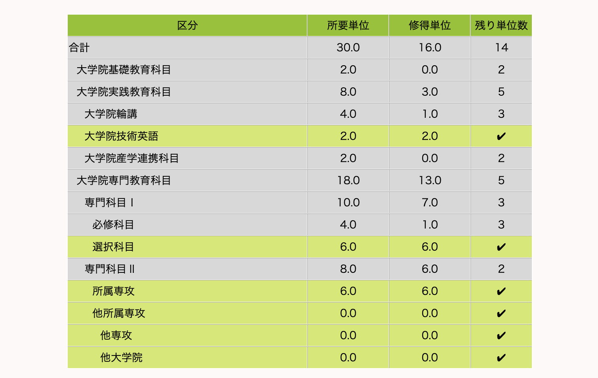

# uec-fulfilled

電気通信大学の[学務情報システム](https://www.uec.ac.jp/campus/academic/)上で確認できる修得単位数が所要単位数を満たしているかどうかを一発で確認するブックマークレット



## 使い方

次のコードをブックマークレットとしてブラウザに登録してください。

```js
javascript:(function(){var s=document.createElement('script');s.src='https://trpfrog.github.io/uec-fulfilled/index.js';document.body.appendChild(s);})();
```

名前はなんでも良いです。「残り単位数の表示」とかで良いと思います。

登録したら、学務情報システムにログインして、成績確認画面に移動してください。その後、登録したブックマークレットをクリックすると、残り単位数が表示されます。**(スクリプトの初回読み込みには数秒かかります)**

全部にチェックがついていたら卒業に必要な単位は揃っているはずです。おめでとうございます。

## 対応ブラウザ

最新版の macOS の Safari, Google Chrome では動作確認ができています。(2023-02-29 現在)

Edge ではセキュリティ上の都合で動かないことがあるみたいです。(要検証)

## デモ

[こちら](https://trpfrog.github.io/uec-fulfilled/)から動作を確認できます。
学務情報システムに入る権限がないけれど動作を確認したいという方 (？) はこちらをご利用ください。

## 開発者向け情報

ブックマークレット本体を修正する場合は、`src` 以下のファイルを編集してください。

### 動作環境

Bun の API を使用しているので [Bun](https://bun.sh/) をインストールする必要があります。

### 開発サーバ

次のコマンドで開発用サーバーを立ち上げます。

```sh
bun run dev
```

アクセスごとにビルドが走るので、`index.ts` への変更が即座に反映されます。

開発サーバを利用してブックマークレットを実行する場合は、次のコードをブックマークレットとして登録してください。

```js
javascript:(function(){var s=document.createElement('script');s.src='http://localhost:3000';document.body.appendChild(s);})();
```

### ビルド

次のコマンドを叩くと `/dist` にブックマークレット用のファイルが生成されます。

```sh
bun run build
```

## その他

卒業見込み学生の成績開示日の翌日にリリースするな

## License

MIT
